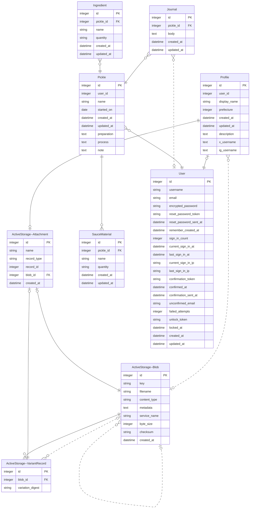

# OCOCO

**漬け物のレシピ・熟成過程記録サービス**

デモサイト: https://ococo.onrender.com  
デモユーザー:
* ユーザーID: mochibanana
* パスワード: password1234

## 機能
* ユーザーの作成・ログイン
* 漬け物レシピの作成・編集・閲覧・削除
* 漬け物ごとの熟成過程をマイクロポストとして投稿・閲覧・削除

## 開発技術
* Ruby 3.2.2
* Ruby on Rails 7.1.1

* Bootsrtap 5.3.2

* PostgreSQL 15 (Renderでは16)

* Docker

* RSpec
  * Model Spec
  * System Spec

* Database initialization

* How to run the test suite

* Services (job queues, cache servers, search engines, etc.)

* Deployment instructions

## ER図

## 追加予定の機能
* 既存の漬け物のレシピを引用する形で漬け物を新規作成する
* レシピを文字列検索する
* 漬け物の記録の投稿時に画像を添付する
* ユーザーをフォローしてフィードを表示する
* 漬け物の記録にコメントを残す